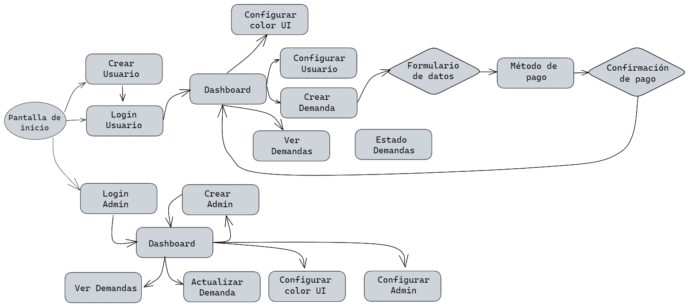
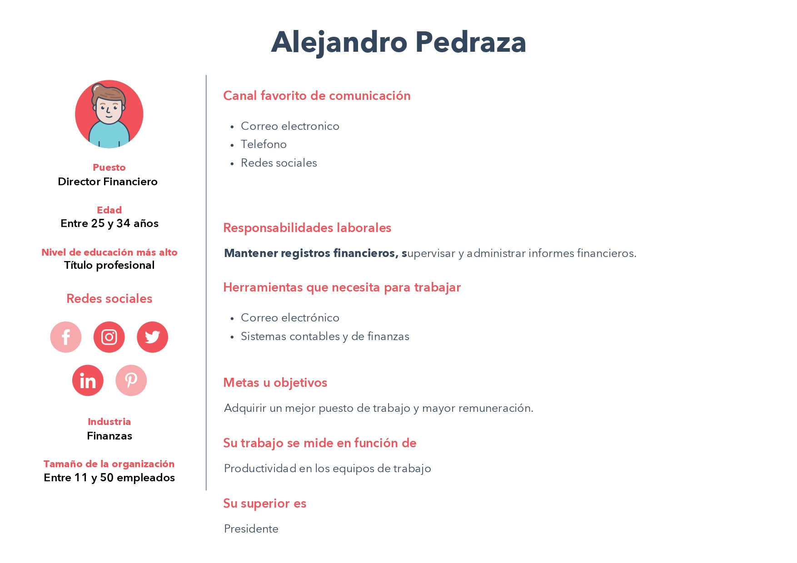
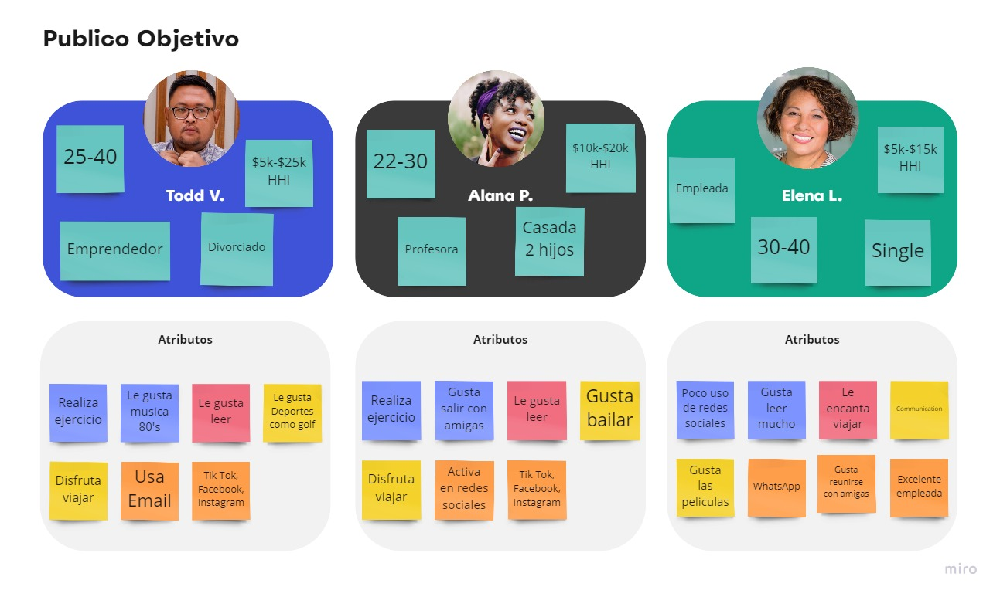

# PRACTICA ABOGABOT 

## **1. Toma de Requerimientos**

### **Descripcion de la soliitud**
#### ****Usuario Solicitante****
La empresa Abogados unidos S. A de C. V. quiere ofrecer sus servicios de manera digital a través de una plataforma en línea llamada "Abogabot". Esta plataforma incluirá un formulario para interactuar con los clientes y permitirá el pago por los servicios solicitados. Para acceder a la plataforma, los clientes necesitarán iniciar sesión y podrán ver el seguimiento de su solicitud desde su panel de usuario. Además, desde el panel de administración de la plataforma, se podrá capturar toda la información de las solicitudes realizadas, generar documentos prellenados con la información del formulario del cliente y descargar un documento en formato Word. Se podrá cambiar el estado de cada solicitud según su etapa de procesamiento y se podrán enviar comentarios o actualizaciones a los clientes por correo electrónico. También se incluirán estadísticas directas sobre el número de solicitudes, los pagos totales realizados, las solicitudes canceladas y las solicitudes en curso.

Para satisfacer las tendencias actuales en cuanto a la utilización de dispositivos móviles, se considera importante que la plataforma sea responsive. La tipografía queda a disposición de los desarrolladores, pero se solicita que se mantengan nuestros colores corporativos (azul marino y blanco) en la plataforma. Sin embargo, estamos abiertos a considerar propuestas creativas antes del desarrollo del producto.

#### ****Líder Funcional****

- Es un despacho de abogados que quiere automatizar las demandas de sus clientes, esto lo harán a través de una página web llenando un formulario.
- Al momento de llenar el formulario se manda al proceso de pago para finalizar la transacción.
- Para dar seguimiento a su demanda, el cliente crea una cuenta en la plataforma y verá el seguimiento de cada una de las actualizaciones del proceso legal.
- El administrador del sitio recibe la notificación de una nueva demanda y con los datos llenados del formulario se crea automáticamente el documento legal en formato Word para empezar el proceso.
- El administrador recibe el pago y debe de ser capaz de verlo en un dashboard para ver la cantidad de ingresos recibidos.
- El administrador actualiza el proceso de la demanda y agrega comentarios en cada paso del proceso.
- Al usuario le llegan correos de notificación para saber el avance de su proceso.
- La página debe de ser responsive para poderla ver desde el celular.
- La preferencia de colores del cliente es azul marino y blanco, pero acepta propuestas.

## **2. Diagrama de la Pagina Web**

## **3. Buyer Persona**

## **3. Publico Objetivo**

