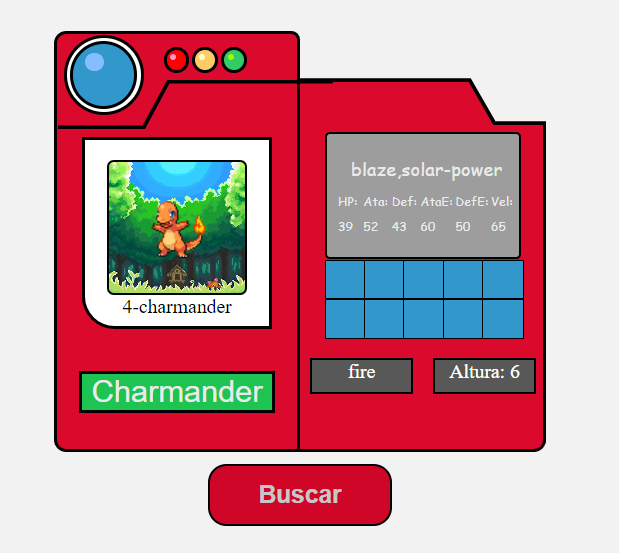

# Modulo 4 - JS

### **Pokedex**
Una Pokedex es una base de datos de información sobre los Pokémon, una serie de criaturas fantásticas que aparecen en los videojuegos, anime y manga de Pokémon.
### **Consumo de la API de Pokemón**
El consumo de la API de Pokémon implica enviar solicitudes a la API y recibir respuestas con la información solicitada, para poder utilizar la en una aplicación o sitio web.

